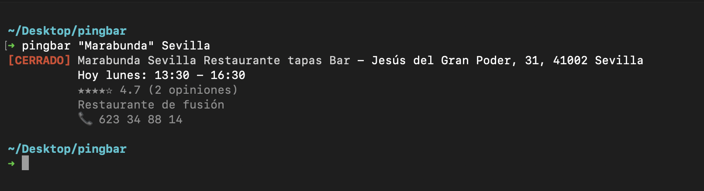
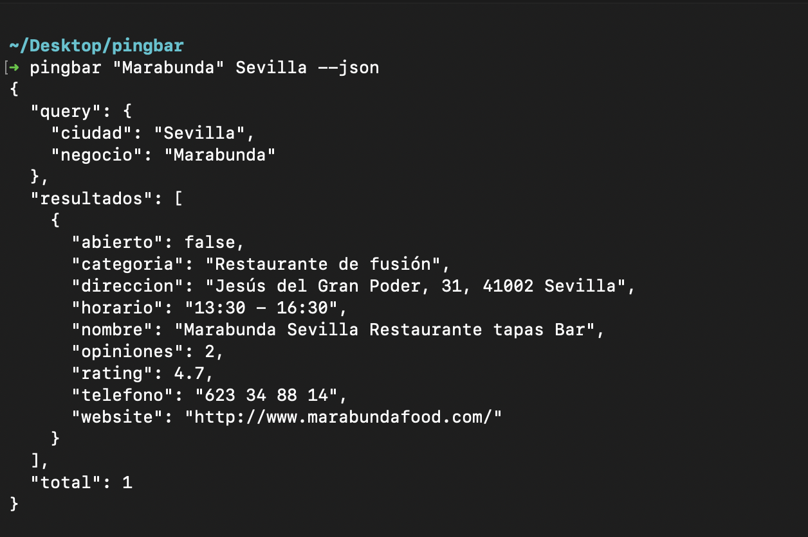

# pingbar

Consulta horarios comerciales de negocios desde la terminal.

**pingbar** es una herramienta de linea de comandos que consulta el horario comercial de cualquier negocio indexado en Google. En lugar de devolver una IP como el comando `ping`, devuelve si el establecimiento esta abierto o cerrado, junto con su horario.



## Instalacion

### Linux / macOS

```bash
curl -sSL https://raw.githubusercontent.com/686f6c61/pingbar/main/install.sh | bash
```

### Windows (PowerShell)

```powershell
irm https://raw.githubusercontent.com/686f6c61/pingbar/main/install.ps1 | iex
```

### Desde codigo fuente

Requiere Go 1.21 o superior.

```bash
git clone https://github.com/686f6c61/pingbar.git
cd pingbar
make build
sudo make install
```

### Instalacion manual (binarios pre-compilados)

Despues de compilar con `make release`, los binarios estan en `build/`:

**macOS (Apple Silicon M1/M2/M3):**
```bash
sudo cp build/pingbar-macos-arm64 /usr/local/bin/pingbar
sudo chmod +x /usr/local/bin/pingbar
```

**macOS (Intel):**
```bash
sudo cp build/pingbar-macos-amd64 /usr/local/bin/pingbar
sudo chmod +x /usr/local/bin/pingbar
```

**Linux (x86_64):**
```bash
sudo cp build/pingbar-linux-amd64 /usr/local/bin/pingbar
sudo chmod +x /usr/local/bin/pingbar
```

**Linux (ARM64):**
```bash
sudo cp build/pingbar-linux-arm64 /usr/local/bin/pingbar
sudo chmod +x /usr/local/bin/pingbar
```

**Windows:**
Copia `build/pingbar-windows-amd64.exe` a una carpeta en tu PATH.

---

## Configuracion

### Obtener API Key (gratuita)

pingbar usa la API de Serper.dev para obtener informacion de negocios.

1. Ve a [https://serper.dev](https://serper.dev)
2. Crea una cuenta gratuita (sin tarjeta de credito)
3. Copia tu API Key del dashboard
4. Configura la key:

```bash
pingbar config set apikey TU_API_KEY
```

**Tier gratuito:** 2,500 busquedas/mes.

---

## Uso

```bash
pingbar <negocio> <ciudad>
```

### Ejemplos

```bash
pingbar "el corte ingles" madrid
pingbar "farmacia" madrid
pingbar "mercadona" barcelona
pingbar "bar" valencia
```

### Salida

```
[ABIERTO] El Corte Ingles Castellana - C/ Raimundo Fernandez Villaverde, 65, Madrid
          Hoy lunes: 10:00 - 22:00
          **** 4.3 (410 opiniones)
          Centro comercial
          Tel: 914 18 88 00
```

```
[CERRADO] Farmacia Garrido - C/ Gran Via, 12, Madrid
          Hoy lunes: 09:30 - 21:00
          **** 4.5 (85 opiniones)
          Farmacia
          Tel: 915 22 11 33
```

```
[ --:-- ] Negocio X - Direccion
          Horario no disponible
          *** 3.8 (50 opiniones)
```

---

## Comandos

### Busqueda principal

```bash
pingbar <negocio> <ciudad>
```

Busca negocios y muestra su estado (abierto/cerrado) junto con horarios.

### Configuracion

```bash
pingbar config set <clave> <valor>    # Establecer valor
pingbar config get <clave>            # Obtener valor
pingbar config list                   # Mostrar toda la configuracion
```

**Claves disponibles:**

| Clave | Descripcion | Valores | Por defecto |
|-------|-------------|---------|-------------|
| `apikey` | API Key de Serper.dev | string | - |
| `lang` | Idioma de salida | `es`, `en` | `es` |
| `default-city` | Ciudad por defecto | string | - |
| `color` | Colores en terminal | `on`, `off`, `auto` | `auto` |
| `default-limit` | Resultados por defecto | 1-50 | `10` |

**Ejemplos:**

```bash
pingbar config set apikey XXXXXXXXXXXXXXXXXXXX
pingbar config set lang es
pingbar config set default-city madrid
pingbar config set color auto
pingbar config set default-limit 10
pingbar config get apikey
pingbar config list
```

### Cache

```bash
pingbar cache clear    # Limpiar cache local
pingbar cache info     # Mostrar informacion de cache
```

La cache almacena resultados de busquedas durante 24 horas para reducir llamadas a la API.

### Informacion

```bash
pingbar about          # Mostrar autor y version
pingbar version        # Mostrar version
pingbar --help         # Mostrar ayuda
```

### Desinstalacion

```bash
pingbar uninstall
```

El comando solicita confirmacion y permite eliminar configuracion y cache.

---

## Flags

| Flag | Descripcion |
|------|-------------|
| `--json` | Salida en formato JSON |
| `--week` | Mostrar horario completo de la semana |
| `--tomorrow` | Mostrar horario de manana |
| `--lang <es\|en>` | Idioma de salida (temporal) |
| `--no-color` | Desactivar colores en la salida |
| `--limit <n>` | Limitar numero de resultados (max 50) |

### Ejemplos con flags

```bash
pingbar "el corte ingles" madrid --json > resultados.json
pingbar "farmacia" madrid --limit 5
pingbar "restaurante" barcelona --lang en
pingbar "bar" valencia --no-color
```

---

## Salida JSON

Con el flag `--json`, la salida es en formato JSON:



```json
{
  "query": {
    "negocio": "el corte ingles",
    "ciudad": "madrid"
  },
  "total": 1,
  "resultados": [
    {
      "nombre": "El Corte Ingles Castellana",
      "direccion": "C/ Raimundo Fernandez Villaverde, 65, Madrid",
      "abierto": true,
      "horario": "10:00 - 22:00",
      "rating": 4.3,
      "opiniones": 410,
      "categoria": "Centro comercial",
      "telefono": "914 18 88 00"
    }
  ]
}
```

---

## Codigo de colores

| Color | Significado |
|-------|-------------|
| Verde | Abierto |
| Rojo | Cerrado |
| Amarillo | Horario no disponible |

---

## Archivos de configuracion

| Sistema | Ruta |
|---------|------|
| Linux | `~/.config/pingbar/config` |
| macOS | `~/.config/pingbar/config` |
| Windows | `%APPDATA%\pingbar\config` |

### Cache

| Sistema | Ruta |
|---------|------|
| Linux | `~/.cache/pingbar/` |
| macOS | `~/.cache/pingbar/` |
| Windows | `%LOCALAPPDATA%\pingbar\cache\` |

---

## Errores comunes

| Error | Solucion |
|-------|----------|
| "No se ha configurado una API Key" | Ejecuta `pingbar config set apikey TU_KEY` |
| "API Key invalida o expirada" | Verifica tu key en https://serper.dev |
| "No se pudo conectar" | Verifica tu conexion a internet |
| "Has alcanzado el limite de busquedas" | Espera al siguiente mes o actualiza tu plan en Serper |

---

## Desarrollo

### Requisitos

- Go 1.21+
- Make (opcional)

### Compilar

```bash
make build          # Compilar para la plataforma actual
make release        # Compilar para todas las plataformas
make install        # Instalar en /usr/local/bin
make clean          # Limpiar archivos generados
make test           # Ejecutar tests
```

### Estructura del proyecto

```
pingbar/
├── main.go
├── cmd/
│   ├── root.go
│   ├── search.go
│   ├── config.go
│   ├── cache.go
│   ├── about.go
│   └── uninstall.go
├── internal/
│   ├── api/
│   │   └── serper.go
│   ├── config/
│   │   └── config.go
│   ├── cache/
│   │   └── cache.go
│   ├── output/
│   │   └── output.go
│   └── i18n/
│       └── i18n.go
├── go.mod
├── Makefile
├── install.sh
└── install.ps1
```

---

## Plataformas soportadas

- Linux (amd64, arm64)
- macOS (amd64, arm64)
- Windows (amd64)

---

## Limitaciones

- La API de Serper Places no proporciona horarios estructurados. Los horarios se extraen de snippets de busqueda de Google, por lo que pueden no estar disponibles para todos los negocios.
- Solo se buscan horarios para los primeros 3 resultados para ahorrar creditos de API.

---

## Licencia

MIT

## Autor

[686f6c61](https://github.com/686f6c61)
